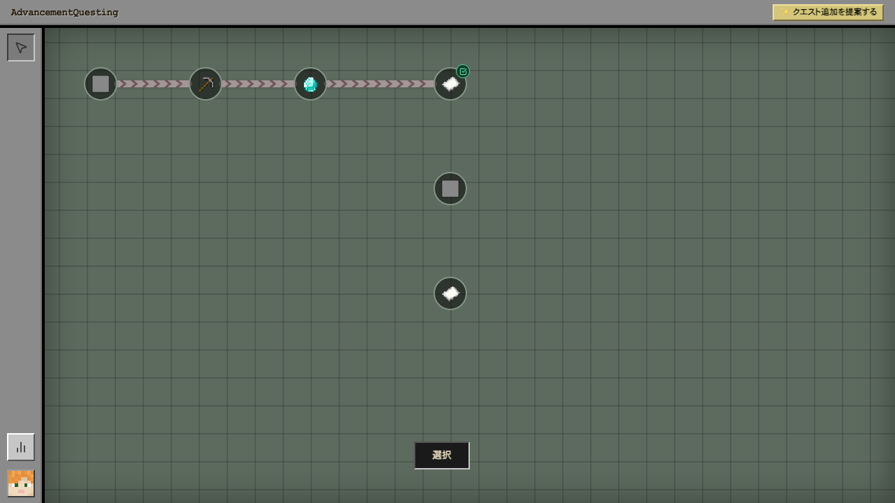
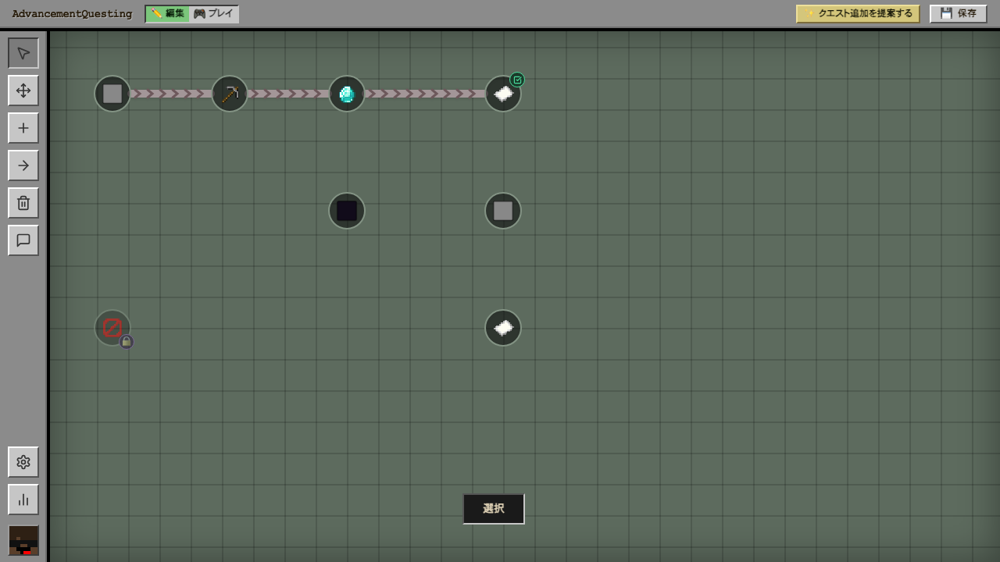
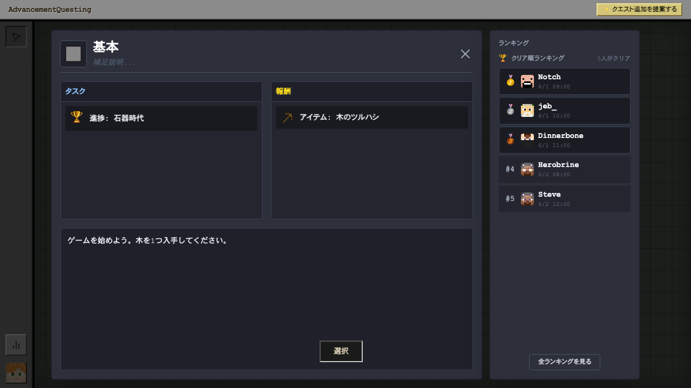
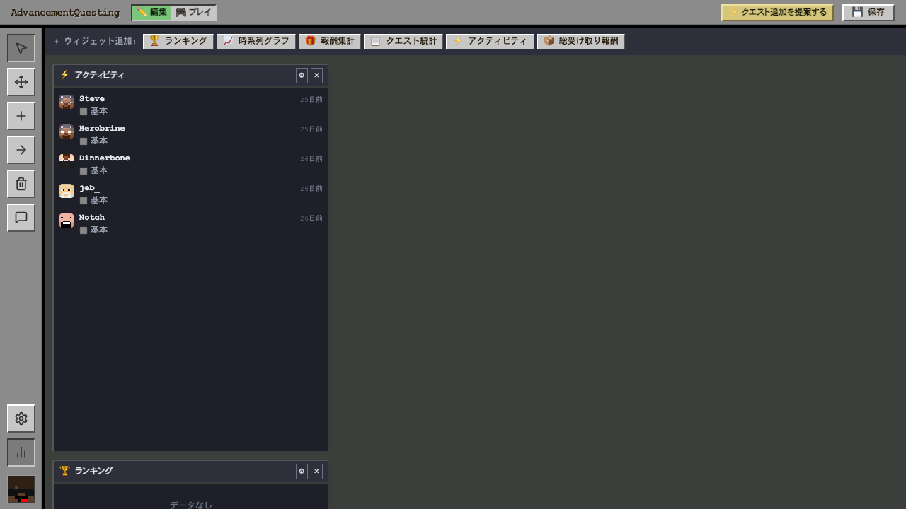
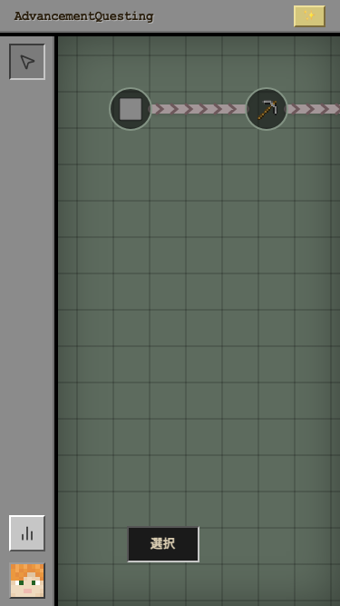

# AdvancementQuesting

Minecraft の進捗（Advancement）をベースにしたクエストシステム PaperMC プラグインです。  
ブラウザで動く Web UI からクエストの作成・管理・進捗確認ができます。

## 機能

- **クエストツリー** — ノードをつないでクエストの依存関係をビジュアルに構成
- **クエスト詳細モーダル** — タスク条件・報酬・説明文・クリアランキングをひとまとめで表示
- **統計ダッシュボード** — アクティビティフィード・ランキング・報酬集計などのウィジェットを自由に配置
- **編集モード / プレイモード** — 管理者は UI 上でクエストを直接編集、プレイヤーはクリーンな閲覧ビューで操作
- **モバイル対応** — スマートフォンからもクエストを確認・選択可能
- **繰り返しクエスト** — 回数制限・クールダウン付きのリピートクエストに対応

## スクリーンショット

### クエストツリー（プレイヤー視点）

アイテムアイコン付きのノードが矢印でつながるツリービュー。クリアしたクエストにはチェックマークが付く。



### クエストツリー（エディター視点）

編集モードではサイドバーにノード操作ツールが表示され、ドラッグ＆ドロップでクエストを配置できる。



### クエスト詳細モーダル

クエストをクリックするとタスク（達成条件）・報酬・説明文が表示される。右サイドにクリア順ランキングを併記。



### 統計ダッシュボード

アクティビティフィードやランキングなど複数のウィジェットをグリッドに自由配置できる管理ビュー。



### モバイル表示

スマートフォンのブラウザからもクエストツリーを閲覧・操作できる。



## アーキテクチャ

```
AdvancementQuesting/
├── src/          # Java バックエンド（PaperMC プラグイン + Javalin HTTP サーバー）
├── web/          # React フロントエンド（TypeScript / Vite）
│   ├── src/      # UI コンポーネント
│   ├── mock-server/   # 開発用モック API（SQLite）
│   └── tests/         # Playwright E2E テスト
└── mc-tests/     # Mineflayer による Minecraft 統合テスト
```

## セットアップ

[CONTRIBUTING.md](CONTRIBUTING.md) を参照してください。

## コマンド

| コマンド | 説明 |
|---|---|
| `/quest` | クエスト Web UI のアクセスコードを表示 |
| `/quest progress` | 自分の進捗サマリーを表示 |
| `/quest claim <id>` | 指定クエストの報酬を受け取る |
| `/quest_edit complete <player> <id>` | プレイヤーのクエストを完了状態にする（管理者用） |
| `/quest_edit uncomplete <player> <id>` | 完了状態を取り消す（管理者用） |

## 権限

| 権限ノード | デフォルト | 説明 |
|---|---|---|
| `aq.player` | 全員 | クエストの閲覧・プレイ |
| `aq.editor` | OP | クエストの編集・管理 |

## 開発

```sh
# フロントエンド開発サーバー（モック API + Vite）
cd web && npm run dev
# → http://localhost:5173/

# フロントエンド E2E テスト
cd web && npm run test:e2e

# Java ビルド
mvn clean package -DskipTests

# Minecraft 統合テスト
cd mc-tests && npm run test
```

## ライセンス

MIT
